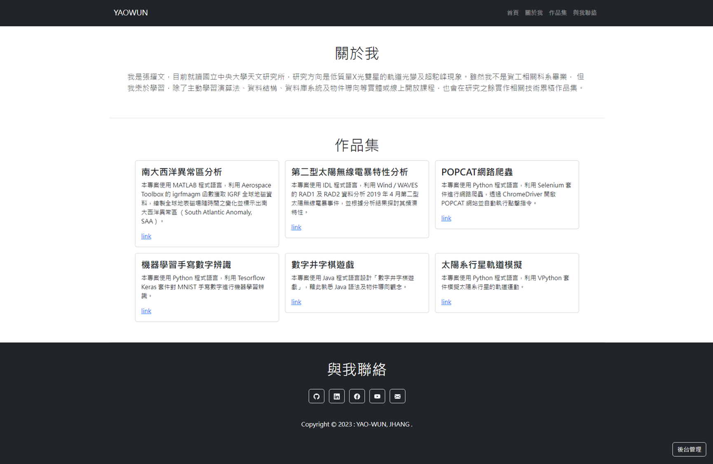
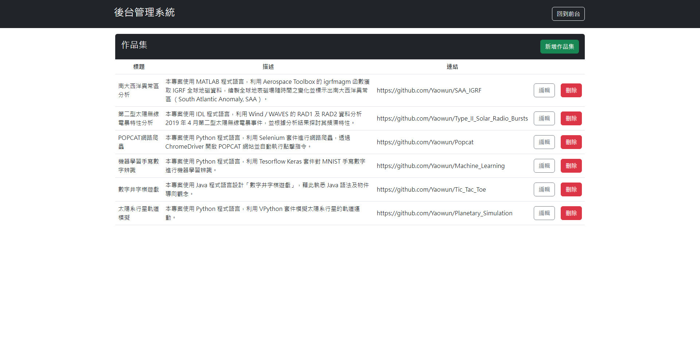

# Personal_Website
## 專案介紹
本專案使用 Ruby on Rails 框架，按照 MVC 架構開發個人作品集網站，使用 SQLite 資料庫系統存放作品集相關資料，並在網頁中設有後台入口可與後端資料庫做串接，執行資料庫的 CRUD 操作。

## 專案技術
Ruby 3.1.3、Rails 7.0、SQLite3 1.4。

## 實作
### 範例
前端作品集展示頁面，包含三個主要區塊
* 關於我
* 作品集
* 與我聯絡

點擊與我聯絡區塊右下角的「後台管理」按鈕，可以進入後台頁面對資料庫做 CRUD 操作。

